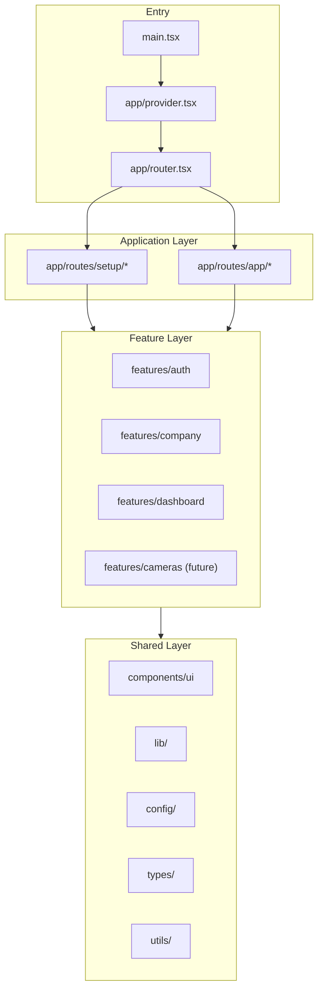

# Architecture

## Overview

The frontend is a **feature-based React SPA** built with Vite. It serves two primary user journeys:

1. **Setup Wizard** — multi-step onboarding (login → company → branch → address → device → user)
2. **Dashboard** — post-setup application shell with sidebar navigation (Home, Cameras, …)



## Architectural Principles

### 1. Feature-based modules

Business logic, UI, and API calls are grouped by **domain feature** (`auth`, `company-address`, `dashboard`), not by technical type (all components in one folder).

### 2. Unidirectional dependency flow

```
shared (components, lib, config, types, utils)
    ↓
features (auth, company, dashboard, …)
    ↓
app (routes, router, providers)
```

**Rules:**

| Allowed | Forbidden |
|---------|-----------|
| `features/auth` → `components/ui` | `features/auth` → `features/company` |
| `app/routes` → `features/*` | `components/ui` → `features/*` |
| `features/*` → `lib/api-client` | `lib/*` → `features/*` |

Cross-feature communication goes through:

- Shared `types/`
- React Query cache invalidation
- URL navigation (`config/paths.ts`)
- App-level providers (`lib/auth.tsx`)

### 3. Thin routes, fat features

Route files (`app/routes/`) orchestrate layout, auth guards, and navigation. They do **not** contain forms, API logic, or complex UI.

### 4. Server state vs client state

| State type | Tool | Location |
|------------|------|----------|
| API / server data | TanStack Query | `features/*/api/` |
| Auth session | react-query-auth | `lib/auth.tsx` |
| Setup wizard progress | localStorage | `features/setup/config.ts` |
| Toast notifications | Zustand | `components/ui/notifications/` |
| Component UI state | `useState` / `useReducer` | Inside components |

Do not put server data in Zustand or localStorage unless explicitly required (setup wizard interim state).

### 5. Type-first development

Define request/response shapes in `types/api.ts` (shared) or feature `types/` before implementing fetchers. Map UI camelCase to backend snake_case in dedicated mapper functions — never inline in components.

## Tech Stack

| Layer | Technology |
|-------|------------|
| Runtime | React 18 |
| Build | Vite 5 |
| Language | TypeScript (strict) |
| Routing | React Router 7 |
| Server state | TanStack Query 5 |
| Forms | React Hook Form + Zod |
| HTTP | Axios |
| Styling | Tailwind CSS 3 |
| Icons | Lucide React |
| Client state | Zustand (notifications) |
| Testing | Vitest + Testing Library |
| API mocking | MSW 2 |
| E2E | Playwright |

## Application Bootstrap

```
main.tsx
  └── app/index.tsx
        └── app/provider.tsx          # QueryClient, Auth, Helmet, ErrorBoundary
              └── app/router.tsx      # createBrowserRouter + lazy routes
```

### Provider responsibilities (`app/provider.tsx`)

- React Query `QueryClientProvider` with `queryConfig` defaults
- Auth context via `react-query-auth`
- Global error boundary
- Notification container
- React Query Devtools (development)

### API client (`lib/api-client.ts`)

- Axios instance with `baseURL` from `config/env.ts`
- Request interceptor: `Authorization: Bearer <token>`
- Response interceptor: unwrap `response.data`, global error toast, 401 redirect to login
- 10s timeout to prevent infinite loading states

## Layout Systems

Two layout patterns exist — do not mix them on the same page.

### Setup Layout

Used by all `/setup/*` wizard steps.

- Top progress stepper (`SetupStepper`)
- Page title
- White content card for forms
- Full-page scroll (not sidebar-based)

**Component:** `features/setup/components/setup-layout.tsx`

### Dashboard Layout

Used by all `/app/*` routes.

- Fixed left sidebar (logo + nav tabs)
- Scrollable main content area via `<Outlet />`
- Sidebar is not scrollable (`overflow-hidden`, `h-screen`)

**Component:** `features/dashboard/components/dashboard-layout.tsx`

## Security (Client-Side)

| Concern | Implementation |
|---------|----------------|
| Authentication | JWT access + refresh tokens in `localStorage` (`lib/auth-tokens.ts`) |
| Authorization UX | Route guards in setup pages (`useUser` + `navigate`) |
| XSS | React default escaping; sanitize HTML if rendering user content |
| API errors | Never expose raw stack traces to users; toast shows `detail` or `message` |

Client-side auth checks are for **UX only**. All permissions must be enforced server-side.

## Performance Conventions

- **Route-level code splitting** — all routes use `lazy()` in `router.tsx`
- **Query staleTime** — 60s default (`lib/react-query.ts`)
- **No refetch on window focus** — disabled globally
- **Colocate state** — prefer component state over global stores

## Environment Configuration

Validated at startup via Zod (`config/env.ts`):

| Variable | Required | Description |
|----------|----------|-------------|
| `VITE_APP_API_URL` | Yes | Backend base URL |
| `VITE_APP_ENABLE_API_MOCKING` | No | `true` = MSW in browser |
| `VITE_APP_APP_URL` | No | Frontend URL (legacy mocks) |

Invalid env causes a hard fail at import time — the app will not start with misconfigured variables.

## See Also

- [Folder Structure](./02-folder-structure.md) — directory reference
- [Routing](./04-routing.md) — URL and layout details
- [API Integration](./05-api-integration.md) — HTTP layer patterns
