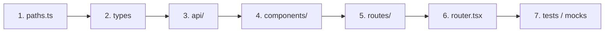

# Feature Development

Step-by-step guide for adding a new frontend feature. Follow this order to stay consistent with the codebase.

## Prerequisites Checklist

Before writing code, confirm:

- [ ] Feature name (kebab-case domain, e.g. `cameras`)
- [ ] URLs / routes needed
- [ ] Layout: Setup wizard step or Dashboard tab?
- [ ] Backend endpoints available (or MSW mock planned)
- [ ] Data dependencies from prior setup steps (companyId, branchId, etc.)

## Standard Workflow



## Step 1 — Register URLs

Add entries in `src/config/paths.ts`:

```typescript
app: {
  cameras: {
    path: 'cameras',           // relative child path under /app
    getHref: () => '/app/cameras',
  },
},
```

Rules:

- Use `getHref()` for all navigation and links — never string literals
- Child routes under `/app` use relative `path` (no leading slash)
- Setup wizard routes use absolute paths (`/setup/...`)

## Step 2 — Define Types

**Shared API types** → `src/types/api.ts`

```typescript
export type Camera = {
  id: string;
  name: string;
  status: 'online' | 'offline';
};

export type CameraCreatePayload = {
  name: string;
  branch_id: string;
};
```

**Feature-only UI types** → `src/features/cameras/types/` or inline in component file.

## Step 3 — API Layer

Create fetcher + hook in `src/features/<feature>/api/`.

### GET (query) pattern

Reference: `src/features/company-address/api/get-countries.ts`

```typescript
// 1. Fetcher
export const getCameras = async (): Promise<Camera[]> => {
  const response = await api.get<unknown, PaginatedApiResponse<Camera[]>>(
    '/api/v1/cameras',
  );
  return response.data ?? [];
};

// 2. Query options (for prefetching / cache keys)
export const getCamerasQueryOptions = () =>
  queryOptions({
    queryKey: ['cameras'],
    queryFn: getCameras,
  });

// 3. Hook
export const useCameras = ({ queryConfig } = {}) => {
  return useQuery({
    ...getCamerasQueryOptions(),
    ...queryConfig,
  });
};
```

### POST (mutation) pattern

Reference: `src/features/company-address/api/register-address.ts`

```typescript
// 1. Input type (camelCase — UI shape)
export type RegisterCameraInput = {
  name: string;
  branchId: string;
};

// 2. Mapper (camelCase → snake_case)
const toCreatePayload = (data: RegisterCameraInput): CameraCreatePayload => ({
  name: data.name,
  branch_id: data.branchId,
});

// 3. Fetcher
export const registerCamera = async (data: RegisterCameraInput): Promise<Camera> => {
  const response = await api.post<CameraCreatePayload, ApiResponse<Camera>>(
    '/api/v1/cameras',
    toCreatePayload(data),
  );
  if (!response.data?.id) {
    throw new Error(response.message || 'Camera registration failed');
  }
  return response.data;
};

// 4. Hook
export const useRegisterCamera = ({ mutationConfig } = {}) => {
  return useMutation({
    ...mutationConfig,
    mutationFn: registerCamera,
  });
};
```

### API file section order

Every API file should follow this structure (see existing files):

1. Form / input shape (camelCase)
2. Payload mapper (`toCreatePayload`, if needed)
3. Fetcher function (async, throws on invalid response)
4. React Query hook (`useQuery` or `useMutation`)

## Step 4 — Components

Create UI in `src/features/<feature>/components/`.

### Form component pattern

Reference: `src/features/company-address/components/company-address-form.tsx`

```typescript
// 1. Zod schema
const cameraSchema = z.object({
  name: z.string().trim().min(1, 'Required').max(128),
});

// 2. Infer form type from schema
type CameraFormInput = z.infer<typeof cameraSchema>;

// 3. Props with navigation callbacks
type CameraFormProps = {
  onBack?: () => void;
  onSuccess: () => void;
};

// 4. Component: Form + mutation + notifications
export const CameraForm = ({ onBack, onSuccess }: CameraFormProps) => {
  const registerCamera = useRegisterCamera({
    mutationConfig: {
      onSuccess: () => {
        addNotification({ type: 'success', title: 'Camera added' });
        onSuccess();
      },
    },
  });

  return (
    <Form schema={cameraSchema} onSubmit={(values) => registerCamera.mutate(values)}>
      {/* fields */}
    </Form>
  );
};
```

### List / display components

Split when a page has multiple concerns:

```
features/cameras/components/
├── camera-list.tsx      # Fetches data, renders grid
├── camera-card.tsx      # Single item presentation
├── camera-form.tsx      # Create/edit form
└── camera-empty-state.tsx
```

## Step 5 — Route (Thin Page)

### Dashboard tab

Reference: `src/app/routes/app/cameras.tsx`

```typescript
import { Head } from '@/components/seo';
import { CameraList } from '@/features/cameras/components/camera-list';

const CamerasRoute = () => (
  <>
    <Head title="Cameras" />
    <div className="px-6 py-8 sm:px-8">
      <CameraList />
    </div>
  </>
);

export default CamerasRoute;
```

### Setup wizard step

Reference: `src/app/routes/setup/company-address.tsx`

```typescript
const SetupCompanyAddressRoute = () => {
  const navigate = useNavigate();
  const user = useUser();
  const setup = readSetupState();

  // Guard: redirect if not logged in
  useEffect(() => {
    if (user.isSuccess && !user.data) {
      navigate(paths.setup.login.getHref(), { replace: true });
    }
  }, [user.isSuccess, user.data, navigate]);

  // Guard: redirect if prerequisite step incomplete
  useEffect(() => {
    if (user.data && !setup.companyBranch?.branchId) {
      navigate(paths.setup.companyBranch.getHref(), { replace: true });
    }
  }, [user.data, setup.companyBranch?.branchId, navigate]);

  if (!user.data || !setup.companyBranch?.branchId) return null;

  return (
    <SetupLayout currentStep={5} title="Company Address">
      <CompanyAddressForm
        onBack={() => navigate(paths.setup.companyBranch.getHref())}
        onSuccess={() => navigate(paths.setup.device.getHref())}
      />
    </SetupLayout>
  );
};
```

## Step 6 — Router Registration

### Dashboard child route

In `src/app/router.tsx`, under `paths.app.path` children:

```typescript
{
  path: paths.app.cameras.path,
  lazy: () => import('./routes/app/cameras').then(convert(queryClient)),
},
```

### Setup wizard route

```typescript
{
  path: paths.setup.companyAddress.path,
  lazy: () =>
    import('./routes/setup/company-address').then(convert(queryClient)),
},
```

### Sidebar navigation (dashboard only)

Add nav item in `src/features/dashboard/components/dashboard-sidebar.tsx`:

```typescript
{
  label: 'Cameras',
  to: paths.app.cameras.getHref(),
  icon: Camera,
},
```

## Step 7 — Tests & Mocks

| Layer | Location | When |
|-------|----------|------|
| MSW handler | `testing/mocks/handlers/<feature>.ts` | API mocked in dev/tests |
| Integration test | `features/<feature>/components/__tests__/` | User workflow matters |
| API unit test | `features/<feature>/api/__tests__/` | Complex payload mapping |

Register new handlers in `testing/mocks/handlers/index.ts`.

## Worked Example A — Setup Step (Company Address)

| Step | File |
|------|------|
| URL | `config/paths.ts` → `setup.companyAddress` |
| Types | `types/api.ts` → `CompanyAddress`, `CompanyAddressCreatePayload` |
| GET APIs | `features/company-address/api/get-countries.ts`, `get-states.ts` |
| POST API | `features/company-address/api/register-address.ts` |
| Form | `features/company-address/components/company-address-form.tsx` |
| Route | `app/routes/setup/company-address.tsx` |
| Router | `app/router.tsx` |
| Wizard config | `features/setup/config.ts` → step 5, `CompanyAddressRegistration` type |

## Worked Example B — Dashboard Tab (Cameras)

| Step | File |
|------|------|
| URL | `config/paths.ts` → `app.cameras` |
| Layout | Already in `features/dashboard/components/dashboard-layout.tsx` |
| Sidebar | `features/dashboard/components/dashboard-sidebar.tsx` |
| Types | `types/api.ts` (when API exists) |
| API | `features/cameras/api/get-cameras.ts` |
| Components | `features/cameras/components/camera-list.tsx` |
| Route | `app/routes/app/cameras.tsx` |
| Router | `app/router.tsx` → child of `/app` |

## Worked Example C — Local-Only Step (Device)

When backend API is not ready:

| Step | File |
|------|------|
| Form | `features/device/components/device-form.tsx` |
| State | `features/setup/config.ts` → `writeSetupState({ device: … })` |
| Route | `app/routes/setup/device.tsx` |
| No `api/` folder until backend is ready |

## Feature Completion Checklist

- [ ] Paths registered in `config/paths.ts`
- [ ] Types defined (shared or feature-scoped)
- [ ] API fetcher validates response (`id` or required fields)
- [ ] React Query hook exported
- [ ] camelCase UI → snake_case API mapping in mapper function
- [ ] Component uses shared `Form`, `Input`, `Button`
- [ ] Route file is thin (< 60 lines)
- [ ] Route guards for auth and prerequisites
- [ ] Router entry added with `lazy()`
- [ ] Sidebar nav updated (if dashboard tab)
- [ ] Setup step added to `SETUP_STEPS` (if wizard step)
- [ ] MSW handler added (if mocking)
- [ ] `yarn lint` and `yarn check-types` pass

## See Also

- [Routing](./04-routing.md)
- [API Integration](./05-api-integration.md)
- [Forms & Validation](./06-forms-and-validation.md)
