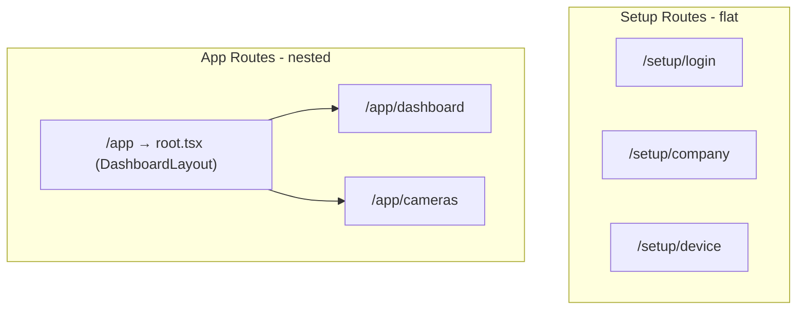

# Routing

URL management, router configuration, and layout patterns for setup wizard and dashboard areas.

## URL Registry

All routes are defined in `src/config/paths.ts`. This is the **single source of truth** for URLs.

```typescript
// Navigation
navigate(paths.setup.company.getHref());
navigate(paths.app.cameras.getHref());

// Links
<NavLink to={paths.app.dashboard.getHref()}>Home</NavLink>

// Redirects
<Navigate to={paths.setup.login.getHref()} replace />
```

Never use raw strings like `navigate('/setup/company')` in application code.

## Route Map

### Setup Wizard (`/setup/*`)

| Step | Label | Path | Route file |
|------|-------|------|------------|
| 1 | Login | `/setup/login` | `routes/setup/login.tsx` |
| — | Register | `/setup/register` | `routes/setup/register.tsx` |
| 2 | Master / Slave | `/setup/master-slave` | `routes/setup/master-slave.tsx` |
| 3 | Company | `/setup/company` | `routes/setup/company.tsx` |
| 4 | Branch | `/setup/company-branch` | `routes/setup/company-branch.tsx` |
| 5 | Address | `/setup/company-address` | `routes/setup/company-address.tsx` |
| 6 | Device | `/setup/device` | `routes/setup/device.tsx` |
| 7 | User | `/setup/user` | `routes/setup/user.tsx` |

After step 7 → navigates to `/app/dashboard`.

### Dashboard (`/app/*`)

| Tab | Path | Route file | Layout |
|-----|------|------------|--------|
| Home | `/app/dashboard` | `routes/app/dashboard.tsx` | Dashboard sidebar |
| Cameras | `/app/cameras` | `routes/app/cameras.tsx` | Dashboard sidebar |

### Redirects

| From | To |
|------|-----|
| `/` | `/setup/login` |
| `/auth/login` | `/setup/login` |
| `/setup` | `/setup/login` |
| `/app` | `/app/dashboard` |
| `*` (unknown) | `/setup/login` |

## Router Architecture



### Lazy loading

All routes use React Router `lazy()` for code splitting:

```typescript
lazy: () => import('./routes/setup/company').then(convert(queryClient)),
```

The `convert` helper wires optional `clientLoader` / `clientAction` with `QueryClient`.

### Nested dashboard routes

```typescript
{
  path: paths.app.path,                    // '/app'
  lazy: () => import('./routes/app/root').then(convert(queryClient)),
  children: [
    { index: true, element: <Navigate to={paths.app.dashboard.getHref()} replace /> },
    { path: paths.app.dashboard.path, lazy: () => import('./routes/app/dashboard')... },
    { path: paths.app.cameras.path, lazy: () => import('./routes/app/cameras')... },
  ],
},
```

- `root.tsx` renders `DashboardLayout` with `<Outlet />`
- Child routes render inside the main content area
- Sidebar persists across tab switches

## Layout Patterns

### Setup Layout

```tsx
<SetupLayout currentStep={3} title="Company Registration">
  <CompanyForm onSuccess={() => navigate(nextPath)} />
</SetupLayout>
```

Provides: stepper, title, white card container, full-page scroll.

### Dashboard Layout

```tsx
// root.tsx — no props needed
<DashboardLayout />  // contains <Outlet />
```

Provides: fixed sidebar + scrollable main. Individual tab pages only render content.

## Route Guards

Setup pages use **client-side guards** in route files:

```typescript
const user = useUser();

// Not authenticated → login
useEffect(() => {
  if (user.isSuccess && !user.data) {
    navigate(paths.setup.login.getHref(), { replace: true });
  }
}, [user.isSuccess, user.data, navigate]);

// Missing prerequisite data → prior step
useEffect(() => {
  if (user.data && !setup.companyBranch?.branchId) {
    navigate(paths.setup.companyBranch.getHref(), { replace: true });
  }
}, [user.data, setup.companyBranch?.branchId, navigate]);

// Block render until guards pass
if (!user.data || !setup.companyBranch?.branchId) return null;
```

### Guard dependency chain (setup wizard)

```
login → master-slave → company → branch → address → device → user → dashboard
```

Each step after login should verify:

1. User session exists (`useUser`)
2. Required IDs from `readSetupState()` exist

## Adding a New Dashboard Tab

1. **paths.ts** — add `app.<tab>.path` and `getHref()`
2. **router.tsx** — add child route under `/app`
3. **dashboard-sidebar.tsx** — add `NavLink` with icon
4. **routes/app/<tab>.tsx** — thin page component
5. **features/<tab>/components/** — actual UI

### Sidebar nav item template

```typescript
{
  label: 'Analytics',
  to: paths.app.analytics.getHref(),
  icon: BarChart3,
},
```

Use `end` prop on `NavLink` for exact match on Home:

```typescript
end={item.to === paths.app.dashboard.getHref()}
```

## Adding a New Setup Step

1. **paths.ts** — add `setup.<step>`
2. **setup/config.ts** — add to `SETUP_STEPS`, update `SetupStepNumber`, add state types if needed
3. **router.tsx** — add flat route
4. **routes/setup/<step>.tsx** — route with guards
5. Update **previous step** `onSuccess` navigation to new step
6. Update **next step** guard to require new step's prerequisite

## Navigation Best Practices

| Scenario | Pattern |
|----------|---------|
| Forward after success | `navigate(paths.setup.device.getHref())` |
| Back button | `navigate(paths.setup.companyBranch.getHref())` |
| Auth redirect | `navigate(paths.setup.login.getHref(), { replace: true })` |
| Post-setup | `navigate(paths.app.dashboard.getHref(), { replace: true })` |
| Query params | `paths.setup.login.getHref(redirectTo)` |

Use `replace: true` for guards and redirects to avoid back-button loops.

## Active Link Styling

Dashboard sidebar uses `NavLink` with `isActive`:

```typescript
className={({ isActive }) =>
  cn(
    'flex items-center gap-3 rounded-lg px-3 py-2.5 text-sm font-medium',
    isActive
      ? 'bg-slate-900 text-white'
      : 'text-slate-600 hover:bg-slate-100 hover:text-slate-900',
  )
}
```

## See Also

- [Feature Development](./03-feature-development.md)
- [Folder Structure](./02-folder-structure.md) — `app/routes/` layout
