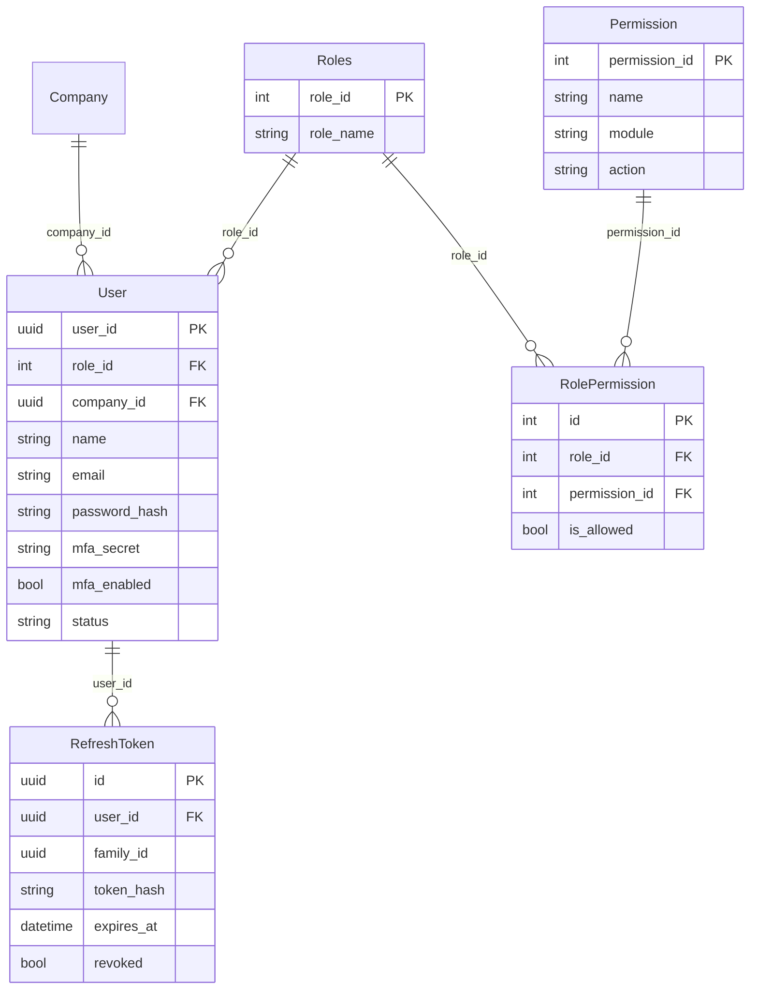
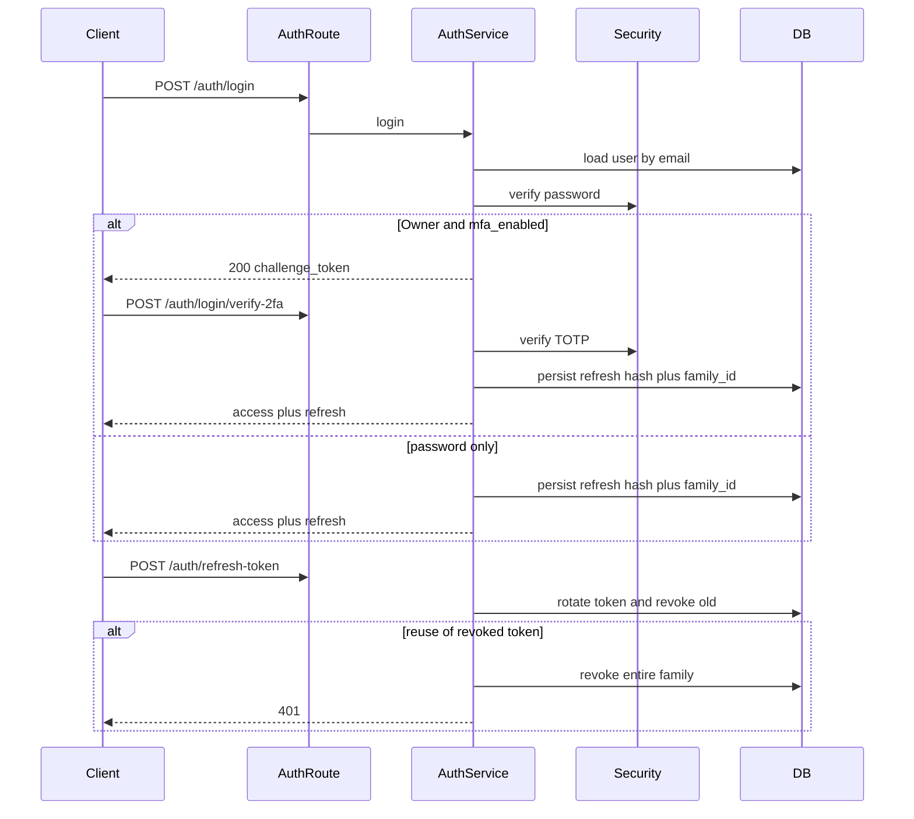

# User management module — Phase 1 plan

Nothing will be created, edited, or run until you approve this plan (and answer the remaining questions below). Phase 2 starts only after that explicit approval.

Source of truth: [user_managemnet_module_specifications.md](user_managemnet_module_specifications.md) (filename typo kept). Conventions: [AGENTS.md](AGENTS.md) + [specifications.md](specifications.md) §4–§5. Patterns copied from [app/company/](app/company/), not from the fuller starter-kit described in specs (that kit is **not** in this repo).

---

## Locked decisions (from you)

- **Roles are global.** Four fixed rows (`owner` / `admin` / `operator` / `viewer`). No `Roles.company_id`. Seed once. Permissions stay global (no `permission.company_id`). Matches [role_permission_seed.sql](role_permission_seed.sql).
- **One role per user via `User.role_id` only.** Do **not** create a `user_role` table, model, repo, schema, or service.
- **2FA:** Owner-mandatory TOTP only. No 2FA for Admin/Operator/Viewer. Add `pyotp`.
- **Registration stays split.** [POST /v1/companies](app/company/routes/v1/company.py) stays company-only (it does not create a user today). `POST /auth/register` creates a user against an existing `company_id`. No combined transaction in this build. No company-module API change.
- **Refresh tokens (you asked for the recommended option):** rotate on every refresh; reuse of a revoked/old token revokes the **whole family** (theft detection). This requires a `family_id` column on `RefreshToken` that the spec’s ER does not list — treated as a justified addition, same class as `mfa_secret` / `mfa_enabled`.

---

## What exists vs what the spec assumes

The company module is the only business module. **Missing** (do not pretend they exist): `app/auth/`, `app/user_management/`, `app/core/api/` (`ListParams`, `ConfigurableRateLimiter`), `app/core/services/` (mail, events bus, cache wrapper, queue), `app/core/exception_handlers.py`, `app/core/listeners.py`, JWT/mail env keys, `app/initial_data.py`, `tests/factories/`, `tests/utils.py`.

**Reuse:** `BaseModel` + `SoftDeleteMixin`, `BaseRepository`, `DBSessionDep`, company-style DI/Gateway/events-as-dataclasses, UUID PKs on business entities, `CompanyGateway.get_company` to validate `company_id`.

**Company cross-module note:** [company_module_specifications.md](company_module_specifications.md) §3.1 has no first-user fields. §4 still says company routes are unauthenticated. With “keep separate”, we **do not** change company endpoints or lock them behind `CurrentUser` in this build. Company spec §5 (“when auth gets applied”) stays an open company-module item.

---

## Remaining questions — you must decide

Do **not** treat the italic notes as chosen answers.

**1. `GET /users/{id}` (and list) visibility** — spec §6 last bullet

- A: Owner/Admin see any user in their company; any authenticated user may `GET /users/{self}`. List stays Owner/Admin-only (`GET /companies/{company_id}/users`).
- B: Owner/Admin only for both get and list; others use `GET /profile` only.
- C: Any authenticated user in the same company can get any coworker; list still Owner/Admin.

**2. Public `POST /auth/register` vs first Owner** — consequence of keeping company create separate

- A: If the company has **zero** users, register creates the **Owner**; if it already has users, public register returns 403 and later users go through `POST /companies/{company_id}/users`.
- B: Public register always creates Owner, and a second Owner is rejected (one Owner per company). Later users only via add-user.
- C: No public register in this build — only `POST /companies/{company_id}/users` (bootstrap Owner via a one-off seed/admin path).

**3. `GET /users/{id}/activity-log`** — `audit` / `Logs` module does not exist

- A: Ship the route, return `501` until `audit` exists.
- B: Ship the route, return `[]`.
- C: Omit the route from this build.

**4. Catalog PK types vs company UUIDs** — seed SQL uses integer `role_id` 1–4 and `permission_id` 1–50 (and spec §2.3 names those ids). Company PKs are UUID.

- A (recommended): Integer PKs for `roles` / `permissions` / `role_permissions` so the seed matrix ports cleanly; UUID for `users` and `refresh_tokens`. `User.company_id` is UUID FK → `companies.company_id`. `User.role_id` is int FK.
- B: UUID everything; rewrite the seed to fixed well-known UUIDs or name lookups.
- C: Integer everything in this module (breaks consistency with `Company.company_id`).

**5. Password-reset token storage** — not in the ER

- A: Nullable `password_reset_token_hash` + `password_reset_expires_at` on `User`.
- B: New `password_reset_tokens` table (entity + repo).
- C: Stateless signed JWT reset token (no DB row; cannot revoke except by password change / secret rotation).

**6. Email sending** — no mail provider in `app/core`

- A: Add Jinja templates now; **do not send** (log at info without email/token). Add `aiosmtplib`/`jinja2` later.
- B: Build a minimal `app/core/services/mail` provider in this build (core change — ask again before touching `app/core/`).
- C: Skip `emails/` entirely until mail core exists.

**7. Domain exceptions → HTTP** — no `exception_handlers.py`; company exceptions currently become 500s

- A: Add `app/core/exception_handlers.py` and register it in `main.py` (core change).
- B: Catch module exceptions in routes and raise `HTTPException` (no core file).
- C: Leave unmapped (not acceptable for 401/403 auth).

---

## Recommended defaults if you approve without picking 1–7

Only used if you say “approve and use recommendations”:

1 → A · 2 → A · 3 → C (omit) · 4 → A · 5 → A · 6 → A · 7 → B

---

## New dependencies (AGENTS.md: ask before adding)


| Package                   | Why                                                                                                                      | Ask?                |
| ------------------------- | ------------------------------------------------------------------------------------------------------------------------ | ------------------- |
| `PyJWT`                   | Access + challenge + refresh JWT verify/sign ([AGENTS.md](AGENTS.md) tech stack)                                         | Yes                 |
| `passlib` (+ `bcrypt`)    | Password hashing                                                                                                         | Yes                 |
| `pyotp`                   | Owner TOTP                                                                                                               | Yes                 |
| `qrcode`                  | **Not** proposed — return `otpauth://` URI + secret; frontend renders QR                                                 | No                  |
| `aiosmtplib` / `jinja2`   | Only if you pick email-send option B                                                                                     | Yes, only then      |
| `fastapi-limiter` / Redis | Spec wants `ConfigurableRateLimiter`; **not in repo**. Defer rate limiting unless you explicitly want core API built now | Yes, if you want it |


Also ask before: editing [pyproject.toml](pyproject.toml), [.sample.env](.sample.env), [app/core/models.py](app/core/models.py), [app/core/routers.py](app/core/routers.py), [app/main.py](app/main.py).

Proposed **module** config ([app/user_management/config.py](app/user_management/config.py), not a rewrite of [app_config.py](app/core/configs/app_config.py)) plus `.sample.env` placeholders:

- `JWT_SECRET_KEY`, `JWT_ALGORITHM=HS256`
- `JWT_ACCESS_TOKEN_EXPIRE_MINUTES` (short)
- `JWT_REFRESH_TOKEN_EXPIRE_DAYS` (longer)
- `JWT_2FA_CHALLENGE_EXPIRE_MINUTES`
- `PASSWORD_RESET_TOKEN_EXPIRE_MINUTES`

Never commit real secrets. Never log passwords, JWT, TOTP secrets, or reset tokens.

`**BaseModel.created_by` / `updated_by` are `Integer**` while `user_id` will be UUID. Do **not** change [app/core/db/base_model.py](app/core/db/base_model.py) in this build (blast radius: whole app). Leave audit actor columns null unless you later approve a core UUID migration.

---

## Data model (after locked decisions)




- Table names follow company style (`users`, `roles`, `permissions`, `role_permissions`, `refresh_tokens`), **not** the seed’s mixed-case `Roles` / `permission`. Seed SQL will be adapted, not executed as-is.
- `User`: `SoftDeleteMixin`; unique email; `status` enum `active` / `disabled`; `mfa_secret` nullable; `mfa_enabled` default false; optional reset-hash columns if you pick Q5-A.
- `Roles` / `Permission`: `BaseModel` only (like `Country`/`State`) or + soft delete to match seed’s `is_deleted`. Prefer mixin on `RolePermission` because seed has `is_deleted`.
- `RefreshToken`: store **hash** of the token, never the raw value; `family_id` for reuse detection; `revoked`.
- FK `users.company_id` → `companies.company_id` (logical FK; validate existence via `CompanyGateway`, not by importing company models).
- Admin-cannot-grant-Owner/Admin is **service-layer only**.

---

## Numbered implementation plan (Phase 2 order)

Practical order differs slightly from the spec’s list: `exceptions.py` and `security.py` must exist before services. File set is the same.

### 0. Ask-first gates (stop until you say yes)

- Add `PyJWT`, `passlib[bcrypt]`, `pyotp` to [pyproject.toml](pyproject.toml).
- Add JWT placeholders to [.sample.env](.sample.env) (not `.env` with real secrets).
- After models exist: `alembic revision --autogenerate` (see § Migration).
- Touch [app/core/models.py](app/core/models.py), [app/core/routers.py](app/core/routers.py).

### 1. `exceptions.py`

`UserManagementException` plus: `UserNotFound`, `UserAlreadyExists`, `InvalidCredentials`, `UserDisabled`, `TwoFactorRequired`, `TwoFactorInvalid`, `TwoFactorNotEnabled`, `RefreshTokenInvalid`, `RefreshTokenReuseDetected`, `PasswordResetInvalid`, `RoleNotFound`, `PermissionDenied`, `InvalidRoleAssignment` (Admin→Owner/Admin), `CompanyHasOwner` / `CompanyHasUsers` (if Q2-A/B).

### 2. Models (one file per entity)

- [app/user_management/models/user.py](app/user_management/models/user.py)
- [app/user_management/models/role.py](app/user_management/models/role.py)
- [app/user_management/models/permission.py](app/user_management/models/permission.py)
- [app/user_management/models/role_permission.py](app/user_management/models/role_permission.py)
- [app/user_management/models/refresh_token.py](app/user_management/models/refresh_token.py)
- [app/user_management/models/**init**.py](app/user_management/models/__init__.py)

No `user_role.py`.

Register imports in [app/core/models.py](app/core/models.py) so Alembic can see them.

### 3. Alembic migration (stop and ask again)

After models are in and registered:

```bash
poetry run alembic revision --autogenerate -m "add user_management tables and user mfa fields"
```

Expected new tables: `users` (including `mfa_secret`, `mfa_enabled`), `roles`, `permissions`, `role_permissions`, `refresh_tokens` (`family_id`, `token_hash`, `expires_at`, `revoked`). No `user_role`. No in-place alter of `companies`.

Then ask before `alembic upgrade head` against the local DB.

**Seed (separate from schema migration):** adapt [role_permission_seed.sql](role_permission_seed.sql) to snake_case table names and real booleans. Prefer a Python seeder (`app/user_management/seed.py` + new `app/initial_data.py`) over a data migration, so it is idempotent (`ON CONFLICT` / “skip if roles exist”). 4 roles × 50 permissions × 200 mappings, global, once.

### 4. Repositories

- `repositories/user.py` — `get_by_id`, `get_by_email`, `list_by_company`, `count_by_company`
- `repositories/role.py` — `get_by_id`, `get_by_name`, `list_all`
- `repositories/permission.py` — `get_by_id`, `get_by_name`, `list_all`
- `repositories/role_permission.py` — `list_by_role`, `is_allowed(role_id, permission_name)`
- `repositories/refresh_token.py` — `get_by_token_hash`, `list_active_by_user`, `revoke_family`, `revoke_all_for_user`
- `repositories/__init__.py`

Same pattern as [app/company/repositories/company.py](app/company/repositories/company.py): extend `BaseRepository`, custom `get_by_id`, filter `is_deleted`, no commit.

### 5. Schemas (`Base` / `Create` / `Update` / `DTO`, `from_attributes=True`)

- `schemas/user.py` — create/update/DTO; **never** include `password_hash`, `mfa_secret`, reset hashes
- `schemas/auth.py` — register, login, token pair, 2FA challenge, 2FA verify, refresh, restore/reset password, 2FA enable payload (`otpauth_uri`, `secret`)
- `schemas/role.py`, `schemas/permission.py`, `schemas/refresh_token.py` (internal/DTO only)
- `schemas/__init__.py` — export DTOs used by Gateway / `__init__.py`

### 6. `security.py` + `config.py`

- Hash/verify password (PassLib bcrypt)
- Create/decode access JWT (`user_id`, `company_id`, `role_name`)
- Create/decode 2FA challenge JWT (purpose claim; not a session)
- Create refresh token (random, hashed at rest) + rotate/reuse-family helpers
- TOTP: `pyotp.TOTP` provision + verify; encrypt-or-at-least-never-log `mfa_secret`
- `CurrentUser` / `ActiveUser` / `RequirePermission("add_user")` dependency factories (export from `__init__.py`)

No SMS/email OTP.

### 7. `emails/` (if Q6 ≠ C)

- `emails/templates.py`
- `emails/views/user_registration.html`
- `emails/views/password_reset.html`
- `emails/views/two_factor_enabled.html`

### 8. Services (transaction = request session, same as company)

- `services/user.py` — company-scoped CRUD, enable/disable, force-logout (revoke all refresh families), admin-triggered reset; validate `company_id` via `CompanyGateway`; assign role with Admin restriction
- `services/auth.py` — register, login (password → tokens **or** 2FA challenge if Owner and `mfa_enabled`), verify-2fa, refresh (rotate + family wipe on reuse), restore/reset password, 2FA enable/confirm/disable (Owner only; disable requires current TOTP)
- `services/role.py` — list roles + permissions
- `services/permission.py` — `has_permission`
- `services/__init__.py`

Owner without `mfa_enabled`: login with password still succeeds for this build so the Owner can call `/auth/2fa/enable`; **mandatory** means they must enable it (enforced on enable-management permission / after first login policy — confirm in Phase 2 if you want login blocked until 2FA is on). Default proposal: **do not block first login**; block only after `mfa_enabled` is true. Enforcing “cannot skip setup” is a follow-up if you want it.

Events: construct dataclasses like company (`_event = UserCreated(...)`); **do not** build a core event bus unless you approve that core work.

### 9. Dependencies

- `dependencies/repositories.py` — `UserRepositoryDep`, `RefreshTokenRepositoryDep`, `RoleRepositoryDep`, `RolePermissionRepositoryDep`, `PermissionRepositoryDep`
- `dependencies/services.py` — `UserServiceDep`, `AuthServiceDep`, `RoleServiceDep`, `PermissionServiceDep`
- `dependencies/auth.py` — `CurrentUser`, `ActiveUser` (if not only in `security.py`)

### 10. Routes (thin; prefixes under module `/v1`)

- `routes/v1/auth.py` — all `/auth/*` from spec §4.1
- `routes/v1/profile.py` — `GET/PATCH /profile`
- `routes/v1/user.py` — company users + `/users/{id}` actions
- `routes/v1/role.py` — `GET /roles`, `GET /roles/{id}/permissions`

Status codes: `201` create, `200` + DTO on soft delete (company style). Lists: `skip`/`limit`, not `ListParams`.

Rate limiting: **deferred** (no `ConfigurableRateLimiter`).

`GET /users/{id}/activity-log`: only if you pick Q3-A or B.

### 11. `routers.py`

`APIRouter(prefix="/v1")` including auth, profile, user, role.

Include in [app/core/routers.py](app/core/routers.py).

### 12. `gateway.py`

UUID `user_id` (spec’s `int` is stale vs company). Methods:

- `get_user`, `get_user_list` (skip/limit), `get_users_by_company`, `has_permission`, `get_role`

DTO-only. `UserManagementGatewayDep`. Import `CompanyGateway` only from `app.company`.

### 13. `events.py`

Dataclasses: `UserCreated`, `UserAddedToCompany`, `UserRoleChanged`, `UserDeleted`/`UserRemoved`, `UserDisabled`, `TwoFactorEnabled`. No `listeners.py` (nothing to consume yet; `audit` does not exist).

### 14. `__init__.py` exports

`CurrentUser`, `ActiveUser`, `UserManagementGateway`, `UserManagementGatewayDep`, `RequirePermission`, `UserDTO`, `RoleDTO`, `PermissionDTO`, `router_v1`.

---

## Auth / RBAC behavior (once built)




`RequirePermission` is for **other** modules later. This build applies it on user-management routes that map to §2.4.2 (`add_user`, `edit_user`, `remove_user`, …). Company routes stay open.

---

## Tests (`tests/user_management/`, mirror AGENTS.md)

Match existing thin style ([tests/conftest.py](tests/conftest.py) in-memory SQLite, no factories) unless you ask for factories.

- `tests/user_management/unit/repositories/test_user_repository.py`
- `tests/user_management/unit/repositories/test_role_repository.py`
- `tests/user_management/unit/repositories/test_permission_repository.py`
- `tests/user_management/unit/repositories/test_role_permission_repository.py`
- `tests/user_management/unit/repositories/test_refresh_token_repository.py`
- `tests/user_management/unit/services/test_user_service.py`
- `tests/user_management/unit/services/test_auth_service.py` (login, 2FA challenge, refresh rotate, reuse wipe, Admin role restriction)
- `tests/user_management/unit/services/test_role_service.py`
- `tests/user_management/unit/services/test_permission_service.py`
- `tests/user_management/unit/test_security.py`
- `tests/user_management/integration/routes/v1/test_auth_routes.py`
- `tests/user_management/integration/routes/v1/test_profile_routes.py`
- `tests/user_management/integration/routes/v1/test_user_routes.py`
- `tests/user_management/integration/routes/v1/test_role_routes.py`

Conftest: seed 4 roles + a subset of permissions (or full 50) in the SQLite schema created by `BaseModel.metadata.create_all`. Need a `Company` row for `company_id` FK tests (reuse company model via metadata, not company internals in assertions).

DoD after Phase 2: `ruff format/check`, `mypy`, `pytest` green. No secrets. No cross-module internal imports.

---

## Out of scope this build

- Auth on company (or any other) module routes
- Combined company+Owner transaction
- `user_role` / per-company roles / per-company permissions
- SMS/email OTP, optional 2FA for non-Owners
- Core mail/events/cache/queue/rate-limiter/ListParams unless you approve those core tasks
- Changing `BaseModel.created_by` to UUID
- `audit` activity-log implementation
- Applying `RequirePermission` outside `user_management`

---

## Approval

Reply with **approval** (and answers to remaining questions 1–7, or “use recommendations”). Phase 2 will implement only what you approve, in the order above, and will **stop again** before `poetry add`, `.sample.env` edits, `alembic revision --autogenerate`, and `alembic upgrade`.